# SM-SPORT

```mermaid
graph TB
    subgraph "Capa de Presentación"
        AC[AuthController]
        CC[ClienteController]
        PC[ProveedorController]
        SC[ServicioController]
        RC[ReservaController]
        ADC[AdminController]
    end

    subgraph "Capa de Seguridad"
        JTF[JwtAuthenticationFilter]
        JTP[JwtTokenProvider]
        CUDS[CustomUserDetailsService]
        SECCONF[SecurityConfig]
    end

    subgraph "Capa de Servicio"
        US[UsuarioService]
        SS[ServicioService]
        RS[ReservaService]
        PS[PagoService]
    end

    subgraph "Implementaciones"
        USI[UsuarioServiceImpl]
        SSI[ServicioServiceImpl]
        RSI[ReservaServiceImpl]
        PSI[PagoServiceImpl]
    end

    subgraph "Capa de Persistencia"
        UR[UsuarioRepository]
        CR[ClienteRepository]
        SR[ServicioRepository]
        RR[ReservaRepository]
        PR[PagoRepository]
    end

    subgraph "Capa de Dominio"
        Usuario[Usuario]
        Cliente[Cliente]
        Proveedor[Proveedor]
        Servicio[Servicio]
        Reserva[Reserva]
        Pago[Pago]
    end

    subgraph "DTOs"
        ReqDTO[Request DTOs]
        ResDTO[Response DTOs]
    end

    subgraph "Mappers"
        UM[UsuarioMapper]
        SM[ServicioMapper]
        RM[ReservaMapper]
    end

    subgraph "Manejo de Excepciones"
        GEH[GlobalExceptionHandler]
        RNF[ResourceNotFoundException]
        BE[BusinessException]
        UE[UnauthorizedException]
    end

    subgraph "Utilidades"
        DU[DateUtil]
        VU[ValidationUtil]
    end

    subgraph "Base de Datos"
        DB[(PostgreSQL/MySQL)]
    end

    AC --> JTF
    CC --> JTF
    PC --> JTF
    SC --> JTF
    RC --> JTF
    ADC --> JTF

    JTF --> JTP
    JTF --> CUDS
    SECCONF --> JTP

    AC --> ReqDTO
    CC --> ReqDTO
    PC --> ReqDTO
    SC --> ReqDTO
    RC --> ReqDTO

    AC --> US
    CC --> SS
    PC --> SS
    SC --> SS
    RC --> RS
    ADC --> US

    US --> USI
    SS --> SSI
    RS --> RSI
    PS --> PSI

    USI --> UR
    SSI --> SR
    RSI --> RR
    PSI --> PR

    UR --> Usuario
    CR --> Cliente
    SR --> Servicio
    RR --> Reserva
    PR --> Pago

    Usuario --> DB
    Cliente --> DB
    Servicio --> DB
    Reserva --> DB
    Pago --> DB

    USI --> UM
    SSI --> SM
    RSI --> RM

    UM --> ResDTO
    SM --> ResDTO
    RM --> ResDTO

    USI --> VU
    RSI --> DU

    AC -.-> GEH
    CC -.-> GEH
    PC -.-> GEH
    SC -.-> GEH
    RC -.-> GEH

    GEH --> RNF
    GEH --> BE
    GEH --> UE

    style AC fill:#4A90E2
    style CC fill:#4A90E2
    style PC fill:#4A90E2
    style SC fill:#4A90E2
    style RC fill:#4A90E2
    style ADC fill:#4A90E2
    
    style JTF fill:#E94B3C
    style JTP fill:#E94B3C
    style SECCONF fill:#E94B3C
    
    style US fill:#50C878
    style SS fill:#50C878
    style RS fill:#50C878
    style PS fill:#50C878
    
    style UR fill:#F39C12
    style CR fill:#F39C12
    style SR fill:#F39C12
    style RR fill:#F39C12
    
    style DB fill:#34495E
```



```text
src/main/java/com/sm_sport/
├── config/
│   ├── SecurityConfig.java
│   ├── JwtConfig.java
│   └── SwaggerConfig.java
├── model/
│   ├── entity/
│   │   ├── Usuario.java
│   │   ├── Cliente.java
│   │   ├── Proveedor.java
│   │   ├── Administrador.java
│   │   ├── Servicio.java
│   │   ├── Reserva.java
│   │   ├── Pago.java
│   │   ├── Resena.java
│   │   └── ... (todas las entidades)
│   ├── enums/
│   │   ├── EstadoUsuario.java
│   │   ├── EstadoReserva.java
│   │   ├── MetodoPago.java
│   │   └── ... (todos los enums)
├── repository/
│   ├── UsuarioRepository.java
│   ├── ClienteRepository.java
│   ├── ServicioRepository.java
│   ├── ReservaRepository.java
│   └── ... (todos los repositorios)
├── service/
│   ├── UsuarioService.java
│   ├── ServicioService.java
│   ├── ReservaService.java
│   ├── PagoService.java
│   └── ... (todos los servicios)
├── service/impl/
│   ├── UsuarioServiceImpl.java
│   ├── ServicioServiceImpl.java
│   └── ... (implementaciones)
├── dto/
│   ├── request/
│   │   ├── RegistroUsuarioRequest.java
│   │   ├── LoginRequest.java
│   │   ├── CrearServicioRequest.java
│   │   └── ReservaRequest.java
│   └── response/
│       ├── UsuarioResponse.java
│       ├── ServicioResponse.java
│       └── ReservaResponse.java
├── controller/
│   ├── AuthController.java
│   ├── ClienteController.java
│   ├── ProveedorController.java
│   ├── ServicioController.java
│   ├── ReservaController.java
│   └── AdminController.java
├── exception/
│   ├── GlobalExceptionHandler.java
│   ├── ResourceNotFoundException.java
│   ├── BusinessException.java
│   └── UnauthorizedException.java
├── security/
│   ├── JwtTokenProvider.java
│   ├── JwtAuthenticationFilter.java
│   └── CustomUserDetailsService.java
├── mapper/
│   ├── UsuarioMapper.java
│   ├── ServicioMapper.java
│   └── ... (mappers con MapStruct)
└── util/
    ├── DateUtil.java
    └── ValidationUtil.java
